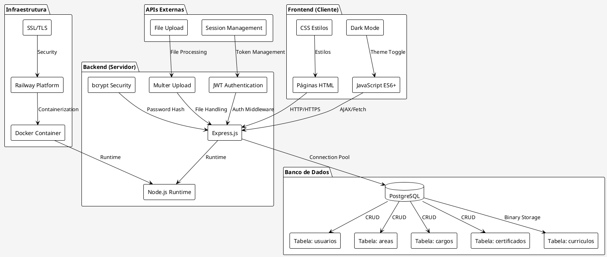
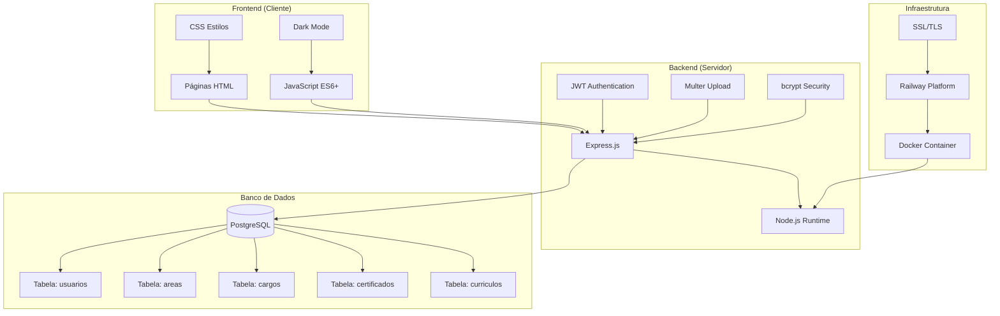
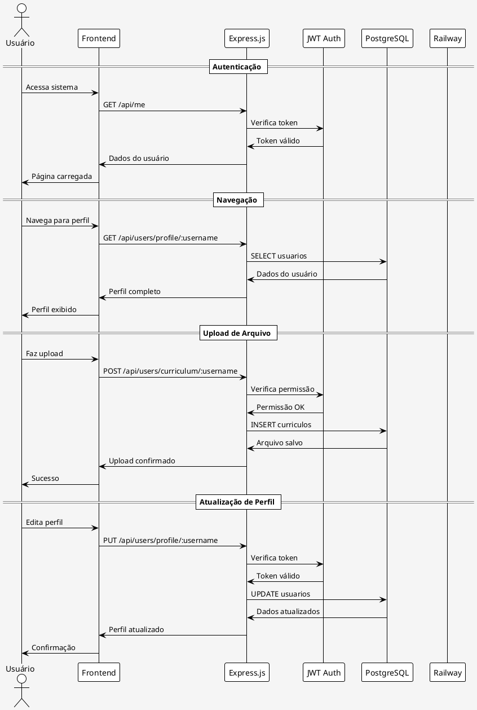
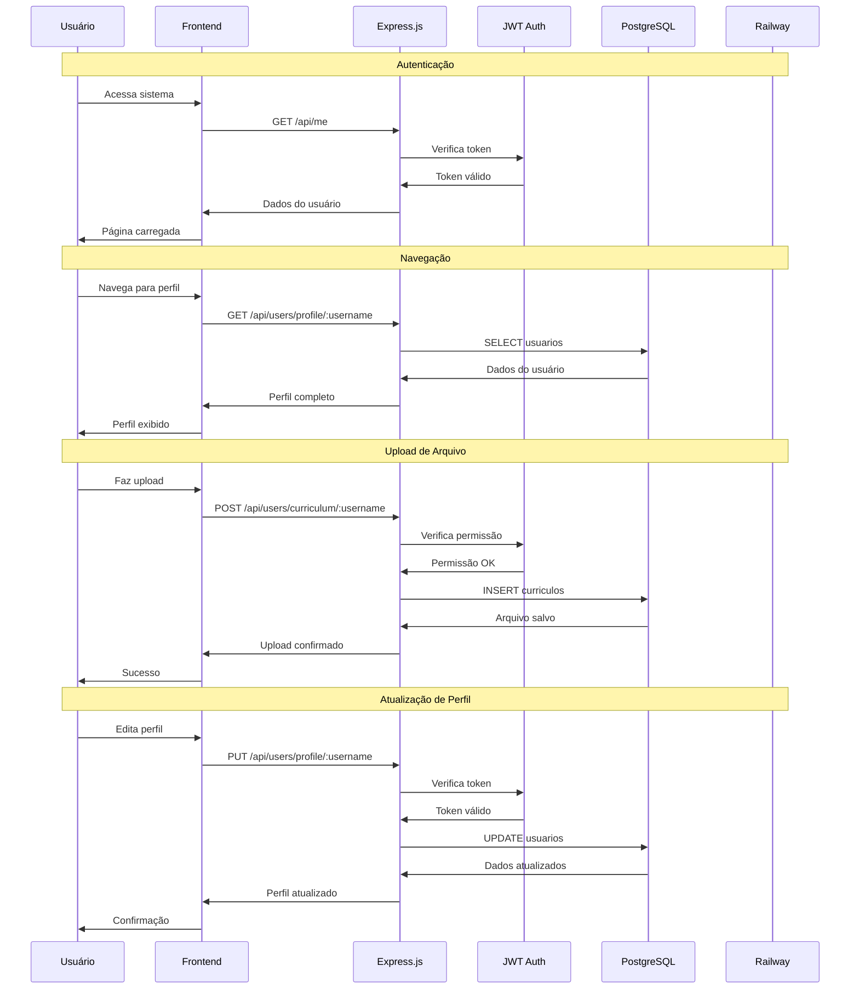
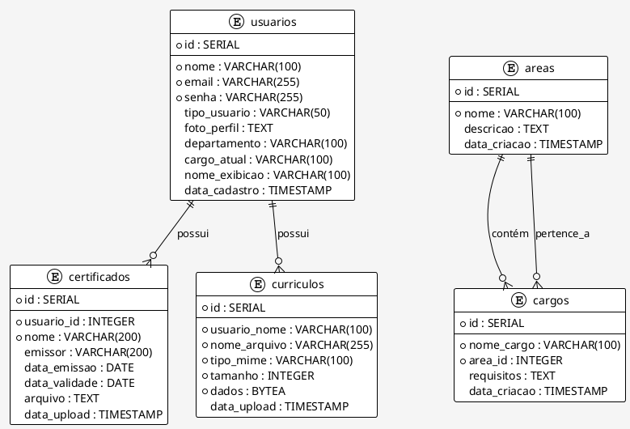
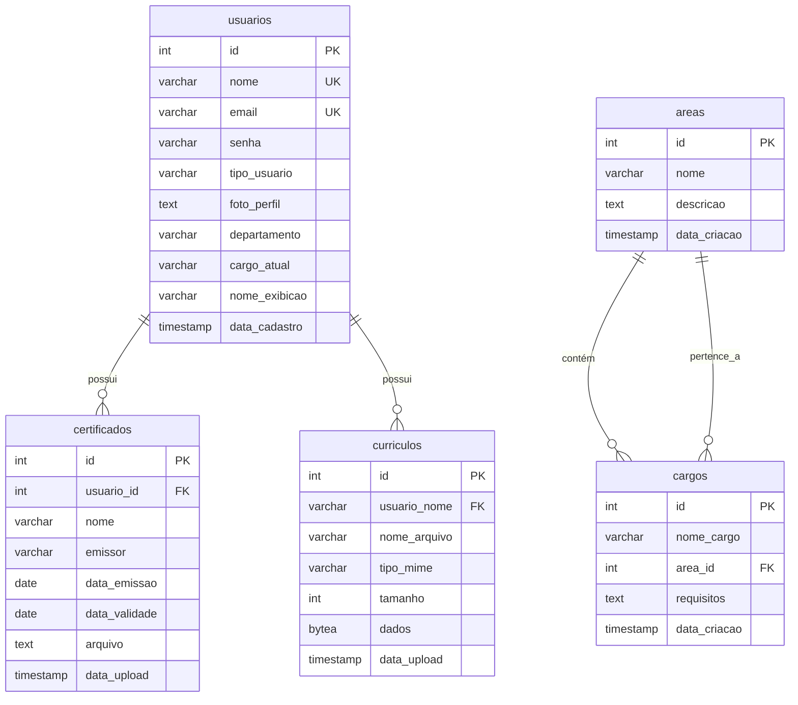
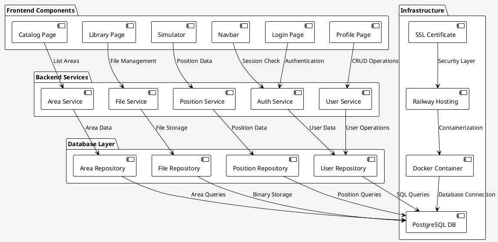
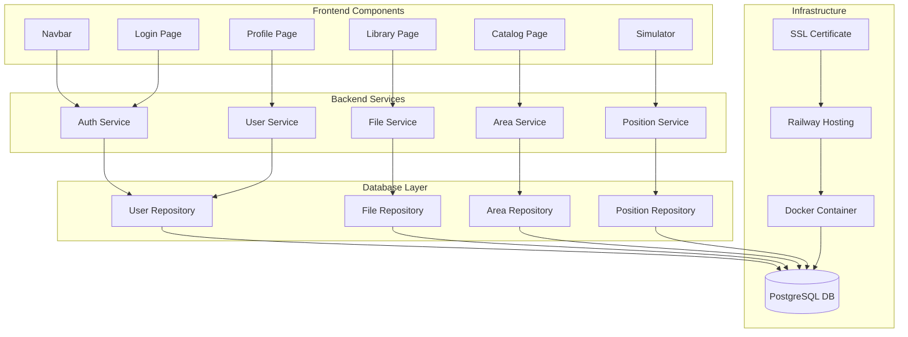

# 🏗️ Arquitetura do Projeto Pearspective

## 📋 Visão Geral

O Pearspective é um sistema de desenvolvimento profissional com arquitetura **Full-Stack** baseada em **Node.js** e **PostgreSQL**, hospedado no **Railway**.

---

## 🏛️ Diagrama de Arquitetura Geral

### PlantUML

### Mermaid

---

## 🔄 Diagrama de Fluxo de Dados

### PlantUML

### Mermaid

---

## 🗄️ Diagrama do Banco de Dados

### PlantUML

### Mermaid

---

## 🏢 Diagrama de Componentes

### PlantUML

### Mermaid

---

## 🛠️ Como Gerar os Diagramas

### **Opção 1: PlantUML Online**
1. Acesse: https://www.plantuml.com/plantuml/uml/
2. Cole o código PlantUML
3. Clique em "Submit"
4. Salve a imagem

### **Opção 2: VS Code Extension**
1. Instale a extensão "PlantUML"
2. Crie arquivo `.puml`
3. Cole o código
4. Pressione `Alt+Shift+D` para preview

### **Opção 3: Mermaid Live Editor**
1. Acesse: https://mermaid.live/
2. Cole o código Mermaid
3. Visualize em tempo real
4. Exporte como PNG/SVG

### **Opção 4: Draw.io**
1. Acesse: https://app.diagrams.net/
2. Crie novo diagrama
3. Use as formas para recriar
4. Exporte como PNG/PDF

---

## 📊 Tecnologias Utilizadas

| Camada | Tecnologia | Versão | Propósito |
|--------|------------|--------|-----------|
| **Frontend** | HTML5 | - | Estrutura |
| **Frontend** | CSS3 | - | Estilização |
| **Frontend** | JavaScript | ES6+ | Interatividade |
| **Backend** | Node.js | 18+ | Runtime |
| **Backend** | Express.js | 4.18+ | Framework |
| **Backend** | JWT | 9.0+ | Autenticação |
| **Backend** | bcrypt | 5.1+ | Criptografia |
| **Backend** | Multer | 1.4+ | Upload de arquivos |
| **Database** | PostgreSQL | 14+ | Banco de dados |
| **Database** | pg | 8.11+ | Driver Node.js |
| **Infra** | Railway | - | Hospedagem |
| **Infra** | Docker | - | Containerização |
| **Infra** | SSL/TLS | - | Segurança |

---

## 🔒 Segurança

- **JWT Tokens** para autenticação
- **bcrypt** para hash de senhas
- **SSL/TLS** para comunicação segura
- **Validação de entrada** em todas as APIs
- **Sanitização de dados** antes do banco
- **CORS** configurado adequadamente

---

## 🚀 Performance

- **Connection Pool** para PostgreSQL
- **Static File Serving** otimizado
- **Compression** de respostas
- **Caching** de dados estáticos
- **Lazy Loading** de componentes
- **Minificação** de assets

---

## 📈 Escalabilidade

- **Arquitetura modular** para fácil expansão
- **Separação de responsabilidades**
- **APIs RESTful** bem definidas
- **Containerização** para deploy consistente
- **Banco de dados** normalizado
- **Logs estruturados** para monitoramento 