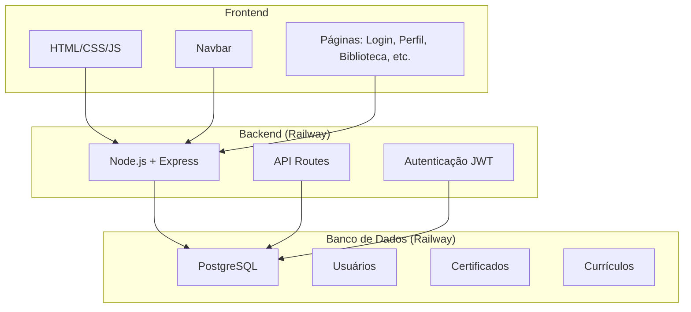
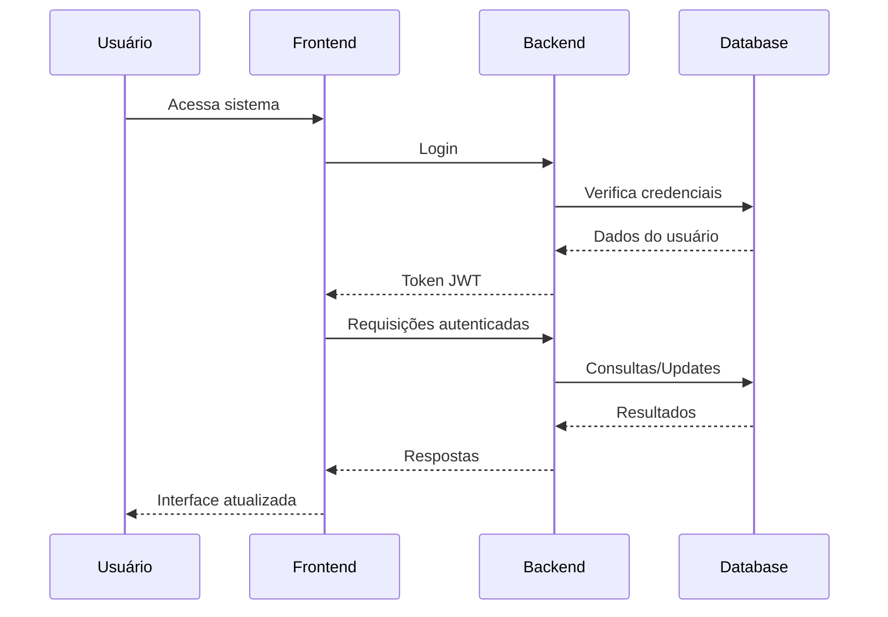

# Diagrama Simples - Pearspective

## Arquitetura Geral



## Fluxo Principal



## Tecnologias

- **Frontend**: HTML5, CSS3, JavaScript ES6+
- **Backend**: Node.js, Express.js
- **Banco**: PostgreSQL (Railway)
- **Deploy**: Railway
- **Autenticação**: JWT
- **Segurança**: HTTPS/SSL

## Como Gerar Imagens

1. **Mermaid Live Editor**: https://mermaid.live
2. **VS Code**: Instalar extensão "Mermaid Preview"
3. **Online**: Copiar código entre ```mermaid e colar no editor

## Estrutura de Arquivos

```
Perspective/
├── api/           # Backend API
├── assets/        # CSS, JS, imagens
├── database/      # Configurações DB
├── docs/          # Documentação
├── scripts/       # Scripts de deploy
└── *.html         # Páginas frontend
``` 